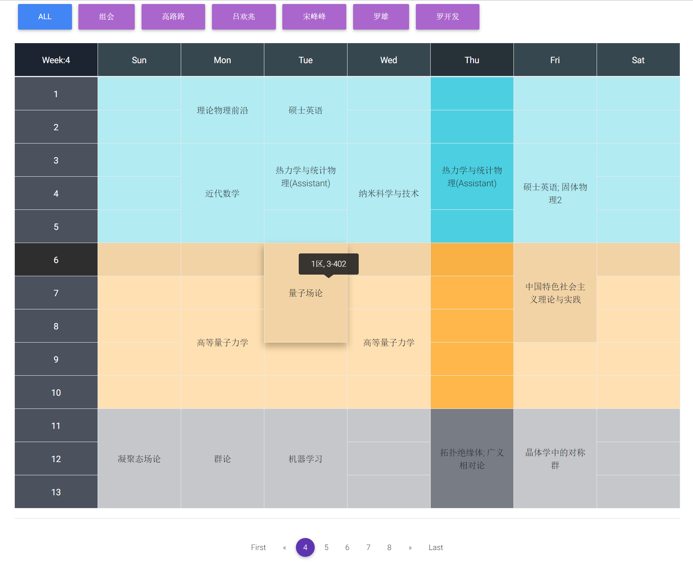
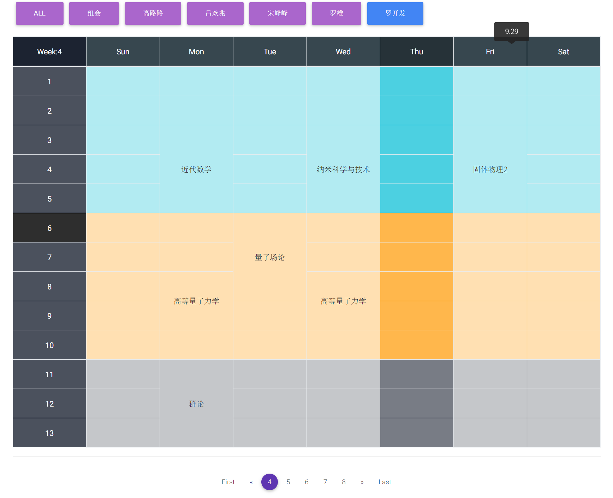
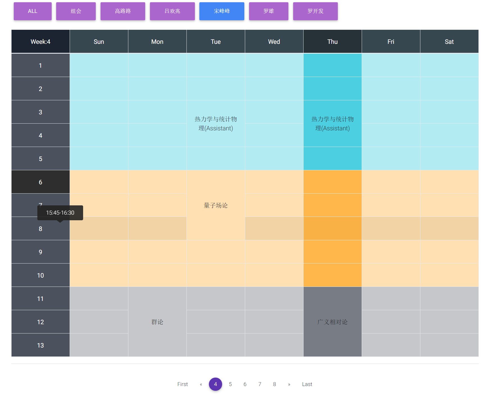
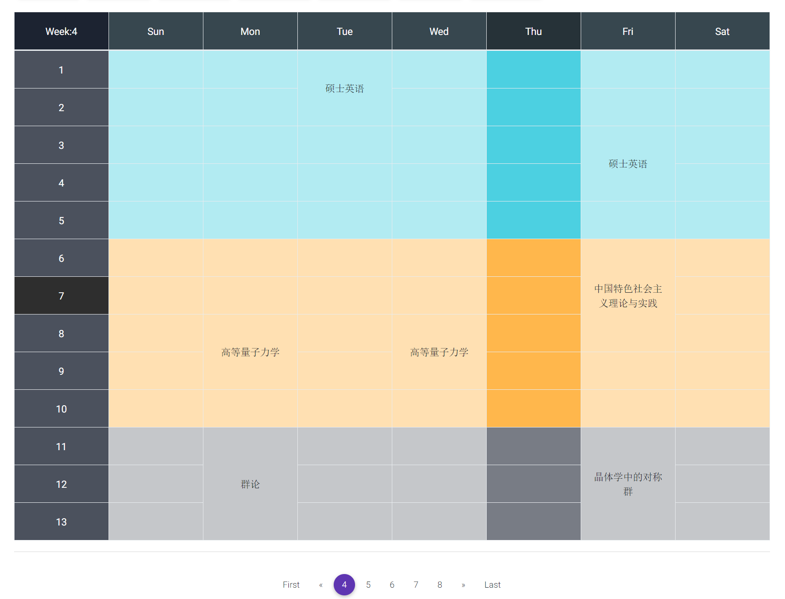

# Class Schedule
a simple class schedule built by [React.js](https://facebook.github.io/react/)

You can view the demo [here](https://mageluer.github.io/schedule/).

**Show Address**


**Show Date**


**Show Time**


**Without Name buttons above if only one person's info is given**


## Table of Contents

- [Getting Started](#getting-started)
  - [Installation](#installation)
    - [Clone this Repo](#clone-this-repo)
    - [Install some tools via NPM](#install-some-tools-via-npm)
    - [Available Scripts](#available-scripts)
      - [npm start](#npm-start)
      - [npm test](#npm-test)
      - [npm run build](#npm-run-build)
  - [Custumizing you class schedule](#custumizing-you-class-schedule)
  - [Publish at GitHub Pages](#publish-at-github-pages)
- [Author](#author)
- [License](#license)

## Getting Started

Create a class schedule App is divided into two steps:

* configurate, build and test the App locally.
* publish this App at [https://myusername.github.io/schedule](https://myusername.github.io/schedule).

Take it easy, it is really a piece of cake :)

### Installation
#### Clone this Repo
Open you terminal, go to the dir you want put this App, then run
```sh
git clone https://github.com/Mageluer/schedule.git
```
> Note: you should have **git** installed. learn more about [Git](https://git-scm.com/) and here are some guide: [gittutorial - A tutorial introduction to Git](https://git-scm.com/docs/gittutorial), [Git教程- 廖雪峰的官方网站](https://www.liaoxuefeng.com/wiki/0013739516305929606dd18361248578c67b8067c8c017b000), [online tutorial](https://try.github.io/levels/1/challenges/1), [git - 简明指南](http://rogerdudler.github.io/git-guide/index.zh.html).

After clone, your project should look like this:
```sh
schedule
├── demo/
├── LICENSE.md
├── package.json
├── public
│   ├── favicon.ico
│   ├── index.html
│   └── manifest.json
├── README.md
└── src
    ├── configuration
    │   ├── schedule-config.js
    │   └── schedule-file.js
    ├── css/
    ├── font/
    ├── img/
    ├── index.js
    └── js/
```

#### Install some tools via NPM
Go to the `schedule/` directory
```sh
cd schedule
```
Then run npm install, this may take a couple of minutes.
```sh
npm install react-scripts react react-dom react-tooltip gh-pages --save-dev
```
> Note: check that you have **node** and **npm** installed, if not you can get it from [Nodejs](https://nodejs.org/zh-cn/), and learn more about [npm](https://www.npmjs.com/). some guide: [NPM 使用介绍](http://www.runoob.com/nodejs/nodejs-npm.html), [A Beginner’s Guide to npm — the Node Package Manager](https://www.sitepoint.com/beginners-guide-node-package-manager/).<br>
> Note: If `npm install` goes very slow, try `npm --registry=https://registry.npm.taobao.org install react-scripts react react-dom react-tooltip gh-pages --save-dev`.

After the installation you will see there is a directory named `node_modules` under the `schedule` directory where the node modules are stored.

#### Available Scripts

In the project directory, you can run:

##### `npm start`

Runs the app in the development mode.<br>
Open [http://localhost:3000](http://localhost:3000) to view it in the browser.<br>
You can try it and have a preview of the App site.

The page will reload if you make edits.<br>
You will also see any lint errors in the console.

##### `npm test`

Launches the test runner in the interactive watch mode.<br>
See the section about [running tests](#running-tests) for more information.

##### `npm run build`

Builds the app for production to the `build` folder.<br>
It correctly bundles React in production mode and optimizes the build for the best performance.

The build is minified and the filenames include the hashes.<br>
Your app is ready to be deployed!

### Custumizing you class schedule
For the project to build, **these files must exist with exact filenames**:

* `public/index.html` is the page template;
* `src/index.js` is the JavaScript entry point.

But here you should not worry about it because you only need to edit the files in `configuration` directory.

The two files
```sh
configuration/
├── schedule-config.js
└── schedule-file.js
```
`schedule-config.js` is the configuration of global settings and `schedule-file.js` contains all your class infomation.

By running `npm start` you can see your classes schedule at [http://localhost:3000](http://localhost:3000).

Note: Be careful when you input your classes, especially `{` and `}`. This App support one our more persons class schedule, that is you can put one or more this kind of structure
```js
{
    name: 'my name',
    classList: [
        {
            title: 'subject-1',  // subject title
            weekRange: [1, 18],  // week range of this subject, from begin to end
            time: {
                1: {  // the number indicate the weekday, from 0 to 6 representing Sunday to Saturday
                    sectionRange: [11, 13],  // the section range is like the range of a subject in a weekday
                    address: '1区, 3-304',  // where you take the lesson, leave it an empty string like: '' if you don't have a address
                },
            },
        },
        {
            title: 'subject-2',
            weekRange: [5, 12],
            time: {
                2: {
                    sectionRange: [6, 8],
                    address: '1区, 3-402',
                },
            },
        },
        {
            title: 'subject-3',
            weekRange: [1, 18],
            time: {
                2: {
                    sectionRange: [3, 4],
                    address: '1区, 3-204',
                },
                4: {
                    sectionRange: [3, 4],
                    address: '1区, 4-201',
                },
            },
        },
    ],
},
```
between
```js
const CLASS_INFO = [
    ......
];
```
The configuration of `schedule-config.js` is as simple as the one above.

After editing is done, run `npm start` and you get it.

### Publish at GitHub Pages
> learn more about [Github](https://github.com/) and [GitHub Pages](https://pages.github.com/)<br>
> learn more about `Git` is helpful: [Git 基础 - 远程仓库的使用](https://git-scm.com/book/zh/v1/Git-%E5%9F%BA%E7%A1%80-%E8%BF%9C%E7%A8%8B%E4%BB%93%E5%BA%93%E7%9A%84%E4%BD%BF%E7%94%A8), [Git远程操作详解](http://www.ruanyifeng.com/blog/2014/06/git_remote.html)<br>
> how to add you local repo to github: [Adding an existing project to GitHub](https://help.github.com/articles/adding-an-existing-project-to-github-using-the-command-line/)<br>
> Take it easy, all you need to do is such simple thing as following
1. [Create a new repository](https://help.github.com/articles/creating-a-new-repository/) named **schedule** on GitHub. To avoid errors, do not initialize the new repository with `README`, `license`, or `gitignore` files. You can add these files after your project has been pushed to GitHub.
2. Open Terminal.
```sh
git config --global user.name <your github username>  # These info is required when you push this repo to your own github.
git config --global user.email <your email address used to register github>
cd schedule  # Change the current working directory to your local project.
rm -rf .git/ # Remove the old git from where you clone
git init  # Initialize the local directory as a Git repository.
git remote add origin https://github.com/my-user-name/schedule.git  # Add the URL for the remote repository where your local repository will be pushed
git remote -v  # Verifies the new remote URL
git add .  # Adds the files in the local repository and stages them for commit.
git commit -m "First commit" # Commits the tracked changes and prepares them to be pushed to a remote repository.
git push origin master  # Pushes the changes in your local repository up to the remote repository you specified as the origin.
```
> Note: use `git status` get the current state

#### Step 1: Add `homepage` to `package.json`

**The step below is important!**<br>
**If you skip it, your app will not deploy correctly.**

Open your `package.json`(schedule/package.json) and add a `homepage` field(change `my-user-name` to your github username):

```js
  "homepage": "https://my-user-name.github.io/schedule",
```

This React App uses the `homepage` field to determine the root URL in the built HTML file.

#### Step 2: Add `deploy` to `scripts` in `package.json`
> Note: `deploy` scripts have already been added, you check whether they exist.

Now, whenever you run `npm run build`, you will see a cheat sheet with instructions on how to deploy to GitHub Pages.

Add the following scripts in your `package.json`:

```diff
  "scripts": {
+   "predeploy": "npm run build",
+   "deploy": "gh-pages -d build",
    "start": "react-scripts start",
    "build": "react-scripts build",
```

The `predeploy` script will run automatically before `deploy` is run.

#### Step 3: Deploy the site by running `npm run deploy`

Then run:

```sh
npm run deploy
```

#### Step 4: Ensure your project’s settings use `gh-pages`

Finally, make sure **GitHub Pages** option in your GitHub project settings is set to use the `gh-pages` branch:


#### Step 5: Optionally, configure the domain

You can configure a custom domain with GitHub Pages by adding a `CNAME` file to the `public/` folder.

#### Step 6: You make it
You open <https://myusername.github.io/schedule> in your browser and you see it!

## Afterwards
Each time you make some modifications to you `schedule-file.js`, you can run `npm start` to view the changes locally.

Then you just need to run
```sh
git add .
git commit -m "some descriptions"
git push origin master
```
to push it to your github master branch.

And run
```sh
npm deploy
```
to publish it online.

## Author
[Mageluer](https://github.com/Mageluer)

## License
MIT
